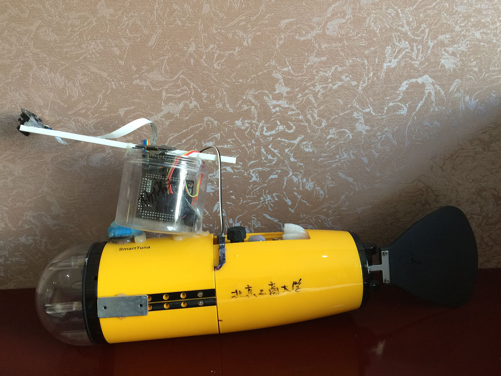
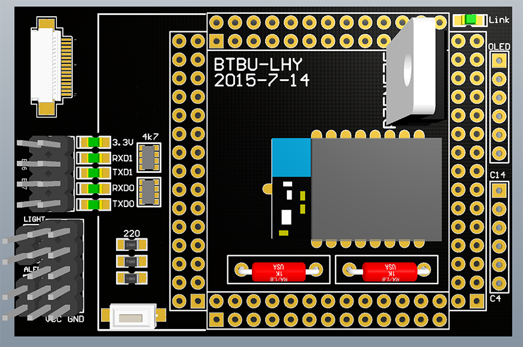
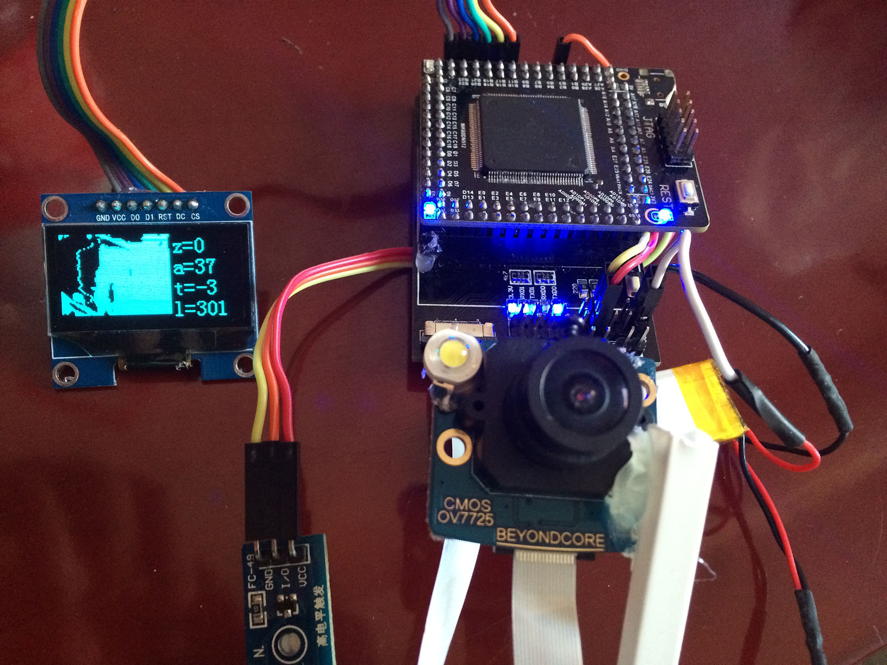
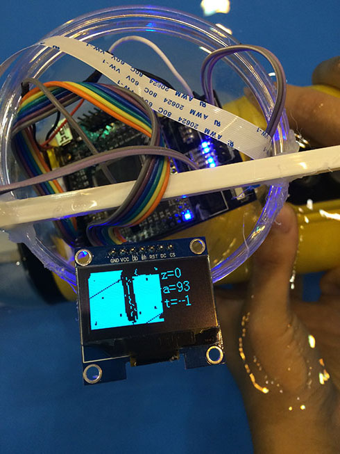
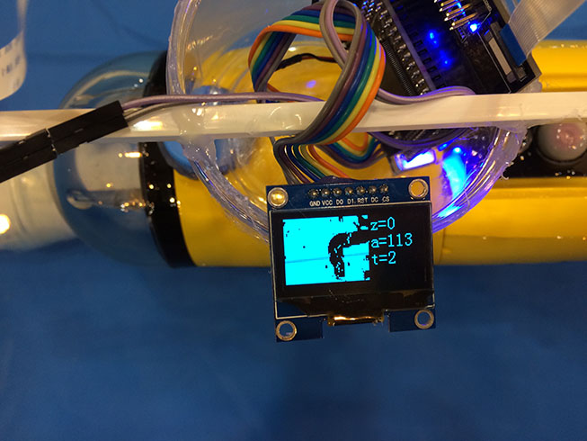
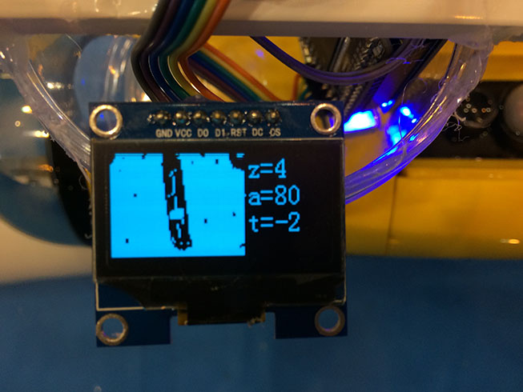

# smartFish



## 简介

2015国际水中机器人大赛比赛视频:http://v.youku.com/v_show/id_XMTI5MjY1ODY4OA==.html

我们整个鱼的原理是:通过摄像头获取赛道信息,然后进行图像处理,识别赛道,将控制命令通过串口回传到ATmega128上,再由ATmega128控制舵机,从而使鱼追随管道游动.当检测到漏油点(黑点)时,IO口控制蜂鸣器响.

为什么没有选择红外?

> 因为我们认为红外无法顺利地拐弯.由于鱼本身的惯性,在红外能检测到拐弯点的时候拐弯,一定会冲出赛道,除非在鱼身下方卡住管子.因此我们放弃了红外的方案.

为什么要摄像头?

> 因为只需要一个摄像头即可完成循迹,矫正鱼身,黑点检测等功能,而且还可以将可疑黑点回传到PC机,解决误报问题.由于摄像头有一定的前瞻,所以我们可以在弯道前方就有预判,从而在不脱离管道的前提下顺利拐过90度弯道.还有一个优势就是可以在不破坏鱼或者较小破坏鱼的情况下完成比赛.

## PCB部分

### 元件

我们使用了:

1. Freescale K60最小系统板
2. OV7725摄像头(硬件二值化)
3. wifi模块(USR-WIFI232-S)
4. OLED屏幕(SPI通讯)
5. 蜂鸣器模块(带有三极管驱动)
6. 3.7V锂电池*2
7. 贴片电阻,LED,按键
8. LED灯珠(1W)
9. 场效应管

**电路板图**:



组装好之后:



## 开发工具

| 工具              | 用途             | 
| --------------- | -------------- | 
| IAR For ARM     | 单片机开发          | 
| Altium Designer | PCB电路板绘制       | 
| Jlink           | 单片机调试          | 
| 串口/串口助手         | 单片机数据回传        | 
| IAR For AVR     | ATmega128单片机开发 | 
| isp下载器/progisp  | ATmega128程序烧写  | 

## 程序思路

首先我们会将采集到的数据存入一个数组里,然后我们会求出每行的白色像素点个数,以及每行的中心点.

``` c
for(y=0;y<HEIGHT;y++)
{
  ave=0;
  sum=0;
  for(x=0;x<WIDTH;x++)
  {
    if(!IMG[x][y]){
      ave += x;
      whites[y]++;
      sum ++;
    }
  }
  ave /= sum;
  IMG[ave][y]=1;
  aves[y]=ave;
  s += ave;
}
average = s/119;
```

### 游直

游直通过中心点的平均值(average)控制,如果图像整体靠左,我们就会向左游,反之则向右.

参考数据:[zhidao.txt](Data/zhidao.txt)



### 拐弯

如果到拐弯的地方,图像上部分白色像素点的个数会减少到2个以内.我们如果检测到像素点少于2个的次数超过5次,则判定属于第一个弯道.之后则改为检测到20行才进行大转弯.这是因为第一个弯道速度快,而第二个弯道速度慢.

参考数据:[wandao3.txt](Data/wandao3.txt)



### 黑点

黑点检测算法目前写得还不够好,原理上是将图像100行到110行的像素点个数,与110行到120行的像素点个数进行对比,若前面比后面多出50个像素点,那么黑点就必定存在于后面.此算法目前无误报,但是会漏报.优化方案有:鱼在行进过程中应该是先后面比前面多出50像素,再是后面比前面多出50像素,如果考虑这一点可以将准确率提高,同时也可以扩大窗口大小,检测20行或许可以获得更好的效果.

参考数据:[zhidao3.txt](Data/zhidao3.txt)



### 通讯

通讯方式为串口.我们原本是采用wifi通讯,但是由于wifi芯片通讯速度太慢(延迟高达秒级别),我们最后采用了有线串口.从无线改为有线之后,我们的转弯反倒提前了不少,最后经过调整能够正常拐弯.

我们对ATmega128进行了少量修改,使用了UART1的PD2(RXD1/INT2)接收数据.

``` c

static void  AppTaskStart (void *p_arg)
{
  	......
    USART1_Init();
}

......

//任务3，用户拓展任务
static void  AppTask3(void *p_arg)
{
    (void)p_arg;
    while (1) {
        //在此拓展任务3，必须使用OSTimeDly(delaytime)作为延时函数，且不能使用死循环
        while(USART1_Receive() != 0x91)OSTimeDly(1);
        unsigned char rec = USART1_Receive();
        switch (rec&0xF0)
        {
            case 0xD0:
                EX_SPEED = rec & 0x0F;
                break;
            case 0xE0:
                EX_DIRECTION = rec & 0x0F;
                break;
            default:
                break;
        }
        OSTimeDly(1);
    }
}
```

## 源代码

[K60部分 main.c](/Project/smartFish/test/src/main.c)

[ATmega128部分 app.c](/SmartTunaOS/Source/APP/app.c)

[oled_spi.c](/Project/smartFish/test/src/oled_spi.c)

[ov7725.c](/Libraries/devices/src/ov7725.c)

[avr_uart.h](/SmartTunaOS/Source/BSP/avr_uart.h)

## 参考资料

[K60固件库参考资料](http://git.oschina.net/yandld/CH-K-Lib/wikis/home)

[OV7725_数据手册.pdf](OV7725_数据手册.pdf)

[超核硬件二值化摄像头使用说明书.pdf](超核硬件二值化摄像头使用说明书.pdf)

[机器鱼通讯协议](6.通信协议 - V1.0.pdf)

[USR-WIFI232-low-V2.5.pdf](USR-WIFI232-low-V2.5.pdf)

[ATmega128中文手册.pdf](ATmega128中文手册.pdf)

[k60摄像头板引脚使用情况.md](k60摄像头板引脚使用情况.md)

[K60基础组PCB.pdf](PCB/K60基础组.pdf)

